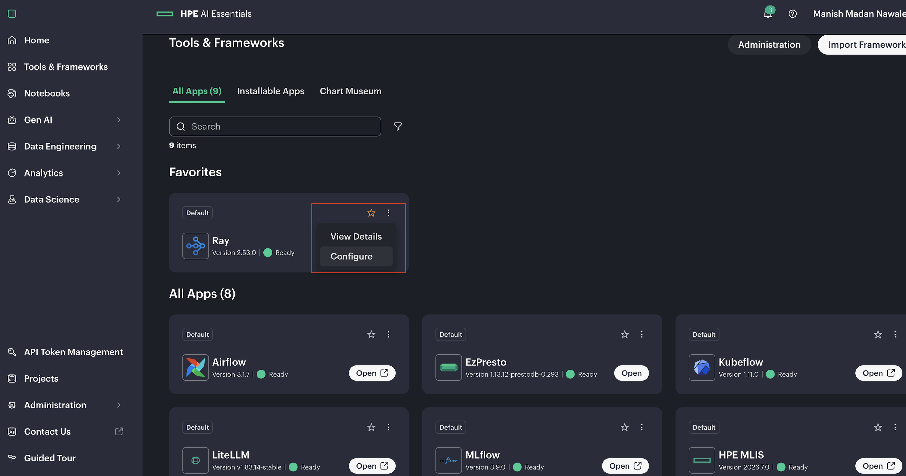
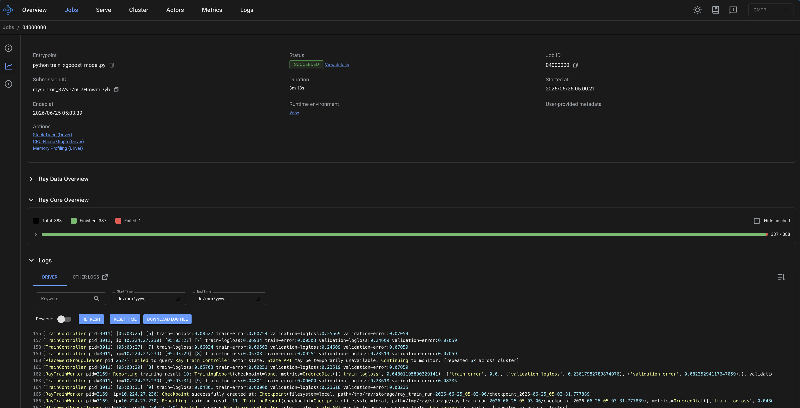
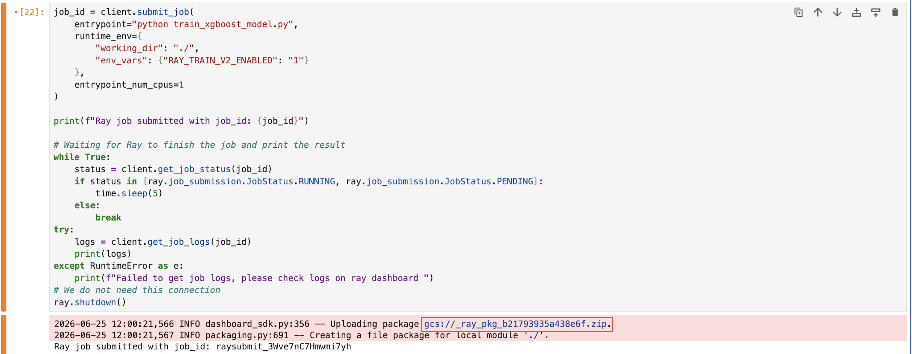

# Distributed XGBoost Training and Serving with Ray

Reference workflow: https://docs.ray.io/en/latest/ray-overview/examples/e2e-xgboost/README.html

This tutorial runs an end-to-end distributed XGBoost workflow with Ray:

- Dataset preprocessing with **Ray Data**
- Distributed XGBoost training with **Ray Train**
- Model artifact serving and prediction with **Ray Serve**

Note: Hyperparameter tuning with Ray Tune is not covered in this tutorial.

## Worker Configuration Guidelines

- The number of workers depends on workload and Kubernetes cluster size.
- Configure 1 Ray worker per Kubernetes node.
- Minimum resources per worker: 8 CPUs and 16 Gi memory.

## Prerequisites

Update the Ray cluster configuration from the Ray UI tile on the Tools and Frameworks page.



---

### Single-Node GPU Training

Enable GPU:

```yaml
###############################
## CONFIG | GLOBAL
###############################
global:
  gpu:
    enabled: "true"
```

Disable smallGroup:

```yaml
additionalWorkerGroups:
  smallGroup:
    disabled: true
    replicas: 0
    minReplicas: 0
    maxReplicas: 0
```

Set worker resources:

```yaml
worker:
  disabled: true
  groupName: workergroup
  replicas: 0
  minReplicas: 0
  maxReplicas: 1
  resources:
    limits:
      cpu: "8"
      memory: "16G"
    requests:
      cpu: "8"
      memory: "16G"
  resources_gpu:
    limits:
      cpu: "8"
      memory: "16G"
      nvidia.com/gpu: "1"
    requests:
      cpu: "8"
      memory: "8G"
      nvidia.com/gpu: "1"
```

---

### Single-Node CPU Training

Disable GPU:

```yaml
###############################
## CONFIG | GLOBAL
###############################
global:
  gpu:
    enabled: "false"
```

Enable smallGroup and set maxReplicas to 1:

```yaml
additionalWorkerGroups:
  smallGroup:
    disabled: false
    replicas: 0
    minReplicas: 0
    maxReplicas: 1
```

Set worker resources:

```yaml
additionalWorkerGroups:
  smallGroup:
    disabled: false
    replicas: 0
    minReplicas: 0
    maxReplicas: 1
    resources:
      limits:
        cpu: "8"
        memory: "16G"
      requests:
        cpu: "8"
        memory: "16G"
```

---

## Multi-Node Training

For multi-node training:

- Set maxReplicas to the number of Kubernetes worker nodes.
- Configure podAntiAffinity so only one Ray worker is scheduled per Kubernetes node.
- Update replicas and resources based on your cluster.

### Multi-Node GPU Training

```yaml
worker:
  groupName: workergroup
  affinity:
    podAntiAffinity:
      requiredDuringSchedulingIgnoredDuringExecution:
        - labelSelector:
            matchLabels:
              ray.io/group: workerGroup
          topologyKey: kubernetes.io/hostname
```
 
---

### Multi-Node CPU Training

```yaml
additionalWorkerGroups:
  smallGroup:
    affinity:
      podAntiAffinity:
        requiredDuringSchedulingIgnoredDuringExecution:
          - labelSelector:
              matchLabels:
                ray.io/group: smallGroup
            topologyKey: kubernetes.io/hostname
```

---

## Run Training and Deploy Serving

After cluster configuration is complete:

**Note: Update `NUM_WORKERS` and `USE_GPU` in `train_xgboost_model.py` based on ray cluster configuration before submitting training job**
1. Open `xgboost_executor.ipynb` and submit the training job.
2. Open the KubeRay dashboard to monitor job progress.



3. After the training job succeeds and artifacts are stored, update `xgboost_model_config.yaml`; replace `working_dir: "zip_URI"` with your GCS package URI.



```yaml
applications:
  - name: app1
    route_prefix: /
    import_path: serve_xgboost:xgboost_model
    runtime_env:
      working_dir: "gcs://_ray_pkg_b21793935a438e6f"
```

4. Deploy the trained model to the remote Ray cluster using serve deploy.
5. After the model is running, execute sample prediction requests.


